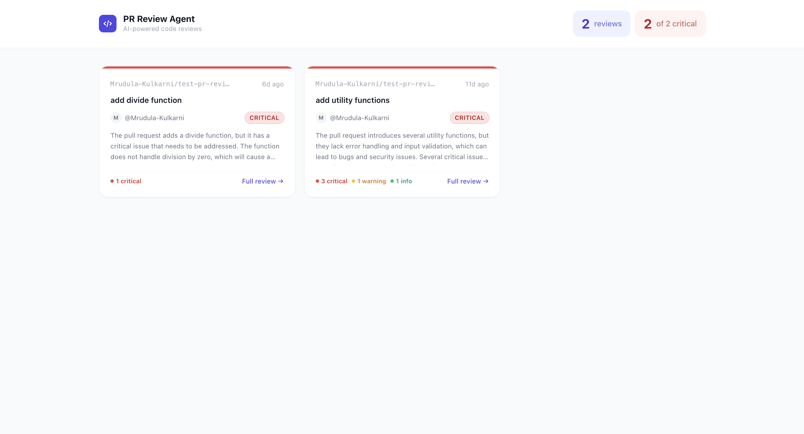

# PR Review Agent

An AI-powered pull request review tool that automatically reviews GitHub PRs and posts inline code comments — built with a **Next.js** frontend and a **FastAPI** backend.

## What it does

When a pull request is opened or updated on GitHub, this agent:

1. **Receives a GitHub webhook** — listens for `opened` and `synchronize` PR events
2. **Fetches the PR diff** — retrieves the changed files from the GitHub API
3. **Reviews the code with AI** — sends the diff to **Groq (Llama 3.3)** which returns a structured review: a plain-English summary and a list of inline comments flagging real issues (bugs, security problems, missing error handling)
4. **Posts inline comments** — automatically posts the AI's comments directly on the PR in GitHub
5. **Sends a Slack notification** — delivers a summary card to a Slack channel with severity color-coding and a link to the PR
6. **Stores reviews** — saves all reviews to a local SQLite database for the dashboard

The **Next.js dashboard** lets you browse all reviewed PRs and drill into the full review detail for any PR, including all inline comments and their severity levels.

## Screenshot



## Tech Stack

| Layer | Technology |
|---|---|
| Frontend | Next.js, Tailwind CSS |
| Backend | FastAPI (Python) |
| AI Provider | Groq (Llama 3.3 70B) |
| Database | SQLite |
| Notifications | Slack Webhooks |
| GitHub Integration | GitHub Webhooks + REST API |

## Project Structure

```
pr-review-agent/
├── frontend/          # Next.js dashboard
│   ├── pages/
│   │   ├── index.js       # All reviews dashboard
│   │   └── pr/[id].js     # Single review detail
│   └── styles/
└── backend/           # FastAPI server
    ├── main.py            # API routes & webhook endpoint
    ├── webhook.py         # Webhook event handling pipeline
    ├── github.py          # GitHub API integration
    ├── llm.py             # Groq review logic
    ├── slack.py           # Slack notification builder
    └── db.py              # SQLite database layer
```

## Setup

### Backend

```bash
cd backend
pip install -r requirements.txt
```

Create a `.env` file (see `.env.example`):

```bash
cp .env.example .env
# Fill in your values
```

Run the server:

```bash
uvicorn main:app --reload
```

### Frontend

```bash
cd frontend
npm install
```

Create a `.env.local` file:

```
NEXT_PUBLIC_BACKEND_URL=http://localhost:8000
```

Run the dev server:

```bash
npm run dev
```

Open [http://localhost:3000](http://localhost:3000).

## Environment Variables

See `.env.example` for all required variables. Never commit your real `.env` file.

## GitHub Webhook Setup

1. Go to your GitHub repo → **Settings → Webhooks → Add webhook**
2. Set the Payload URL to your backend URL: `https://your-backend.com/webhook`
3. Content type: `application/json`
4. Secret: the value you set as `GITHUB_WEBHOOK_SECRET`
5. Select **Pull requests** events only

